# AIGENKI Data Model

Entity-relationship diagram for all Firestore collections.
Global collections are independent of any user. Per-user collections live under `users/{uid}/`.

---

## Diagram

```mermaid
erDiagram

    %% ═══════════════════════════════════════════════════════
    %% GLOBAL COLLECTIONS
    %% ═══════════════════════════════════════════════════════

    KnowledgeUnit {
        string id PK
        string content       "canonical identifier: pattern (Grammar), word (Vocab/Kanji)"
        string type          "Vocab | Kanji | Grammar | ExampleSentence"
        string data_title    "Grammar only"
        string data_corpusNotes "Grammar only — AI prompt context, not lesson content"
        string data_jlptLevel   "Grammar only — MISSING from backend type, present in frontend type"
        object data_classification "Grammar only — hand-authored, never AI-generated"
        object data_exampleInContext "Grammar only — seed for lesson generation"
        string data_reading      "Vocab only"
        string data_definition   "Vocab only"
        string data_conjugationType "Vocab only"
        number data_wanikaniLevel "Vocab/Kanji"
        string data_meaning  "Kanji only"
    }

    Concept {
        string id PK
        string content
        string data_title
        string data_overview
        string data_reading  "optional kana reading of title"
        array  data_mechanics
        array  data_examples
    }

    Lesson {
        string kuId PK       "= KnowledgeUnit.id — one lesson per KU"
        string type          "Vocab | Kanji | Grammar"
        string pattern       "Grammar — overridden with KU.content at read time"
        string title         "Grammar — overridden with KU.data.title at read time"
        string notes         "Grammar — editable; admin writes to global doc, users to overlay"
        string formation     "Grammar — string or string[]"
        array  examples      "Grammar"
        string reading       "Vocab"
        array  definitions   "Vocab"
        array  context_examples "Vocab"
        array  component_kanji  "Vocab"
        string classification "Grammar — should NOT be here; classification is KU-level only"
    }

    Question {
        string id PK
        string kuId             "FK → KnowledgeUnit.id OR Concept.id (POLYMORPHIC)"
        string sourceCollection "knowledge-units | concepts | scenarios — optional, absent on old docs"
        number rank             "0–100, starts 50, suitable threshold 30"
        number rejectionCount
    }

    %% ═══════════════════════════════════════════════════════
    %% PER-USER  (users/{uid}/...)
    %% ═══════════════════════════════════════════════════════

    UserRoot {
        string uid PK        "= Firebase Auth UID"
        string email
        boolean isAdmin
        object  stats        "reviewForecast, streak, totals, levelProgress"
        object  tutorContext "frontierVocab, leechVocab, allowedGrammar, weakGrammarPoints, currentCurriculumNode"
        object  preferences  "showFurigana, jlptLevel, preferredUserRole"
    }

    UserKnowledgeUnit {
        string kuId PK       "= KnowledgeUnit.id"
        string status        "learning | reviewing | mastered — owned by LearningProgressService"
        number facet_count
        string source_type   "scenario | lesson"
        string source_id     "FK → Scenario.id OR Lesson.kuId"
    }

    ReviewFacet {
        string id PK
        string kuId             "FK — collection varies; use sourceCollection to resolve"
        string sourceCollection "knowledge-units | concepts | scenarios — optional, absent on old docs; use resolveKuCollection() helper"
        string facetType
        number srsStage         "0–8"
        timestamp nextReviewAt
        number consecutiveFailures
        string currentQuestionId "FK → Question.id"
        string source_type      "lesson | concept — MISSING: scenario"
        string source_id
        boolean selfCertified
        object data             "facet-type-specific payload"
    }

    Scenario {
        string id PK
        string sourceKuId    "FK → KnowledgeUnit.id (optional)"
        string state         "encounter | drill | simulate | completed"
        array  grammarMatches "kuId refs FK → KnowledgeUnit.id (Grammar) — AI-generated, UNVALIDATED"
        array  extractedKUs  "kuId refs FK → KnowledgeUnit.id"
        boolean vocabReady
        object  roles
        object  progress     "keyed by ScenarioDifficulty (N5..N1)"
    }

    UserGrammarLesson {
        string id PK         "= {kuId}_{sourceType}_{sourceId} (deterministic)"
        string kuId          "FK → KnowledgeUnit.id (Grammar type only)"
        string sourceType    "scenario | concept"
        string sourceId      "FK → Scenario.id OR Concept.id"
        object contextExample "japanese, english, fragments, accepted_alternatives"
    }

    UserLessonOverlay {
        string kuId PK       "= KnowledgeUnit.id — merged on top of Lesson at read time"
        string notes         "Grammar: overrides Lesson.notes"
        string meaning_explanation "Vocab: overrides Lesson field"
    }

    UserQuestionState {
        string questionId PK "FK → Question.id"
        string kuId          "denormalized from Question.kuId"
        boolean rejected
        number  consecutiveFailures
    }

    UserConcept {
        string id PK
        string conceptId     "FK → Concept.id"
        timestamp startedAt
        number facetCount
    }

    FeedItem {
        string id PK
        string type          "review | learn | leech-repair"
        string targetId      "FK → ReviewFacet.id OR KnowledgeUnit.id (POLYMORPHIC)"
        string kuId          "FK → KnowledgeUnit.id"
        string kuType
        number priority
        string status        "pending | completed | skipped"
    }

    %% ═══════════════════════════════════════════════════════
    %% RELATIONSHIPS
    %% ═══════════════════════════════════════════════════════

    KnowledgeUnit ||--o| Lesson : "generates (keyed by kuId)"
    KnowledgeUnit ||--o| UserLessonOverlay : "overlay (keyed by kuId)"
    KnowledgeUnit ||--o{ UserKnowledgeUnit : "enrolled as"
    KnowledgeUnit ||--o{ ReviewFacet : "drilled by (Vocab/Kanji/Grammar facets)"
    KnowledgeUnit ||--o{ Question : "questions drawn from"
    KnowledgeUnit ||--o{ UserGrammarLesson : "encountered as grammar"
    KnowledgeUnit o|--o{ Scenario : "sourceKuId"
    KnowledgeUnit ||--o{ FeedItem : "referenced by"

    Concept ||--o{ ReviewFacet : "drilled by (Concept facets)"
    Concept ||--o{ Question : "questions drawn from"
    Concept ||--o{ UserConcept : "enrolled as"
    Concept ||--o{ UserGrammarLesson : "introduces grammar via concept"

    Scenario ||--o{ ReviewFacet : "drilled by (sentence-assembly facets)"
    Scenario ||--o{ UserGrammarLesson : "introduces grammar via scenario"

    Question ||--o{ UserQuestionState : "per-user state"
    ReviewFacet o|--o| Question : "currentQuestionId"

    UserRoot ||--o{ UserKnowledgeUnit : "owns"
    UserRoot ||--o{ ReviewFacet : "owns"
    UserRoot ||--o{ Scenario : "owns"
    UserRoot ||--o{ UserGrammarLesson : "owns"
    UserRoot ||--o{ UserLessonOverlay : "owns"
    UserRoot ||--o{ UserQuestionState : "owns"
    UserRoot ||--o{ UserConcept : "owns"
    UserRoot ||--o{ FeedItem : "owns"
```

---

## Anomalies & Inconsistencies

### 1. `ReviewFacet.kuId` is polymorphic
Points to `knowledge-units/{id}`, `concepts/{id}`, OR `users/{uid}/scenarios/{id}` depending on `facetType`. No field on the facet document indicates which collection to query — callers must know the implicit mapping from `facetType` to collection. This is the root cause of the vocab-gate problem documented in ARCHITECTURE.md. FIXED
### 2. `Question.kuId` is polymorphic
Same issue as ReviewFacet — points to `knowledge-units` OR `concepts`. `QuestionsService.generateAndSave` handles this with a try/catch fallback but there is no discriminant on the document. FIXED
### 3. `Concept` is not in `knowledge-units`
`ConceptKnowledgeUnit` is a subtype of `KnowledgeUnit` in the TypeScript union, but `Concept` documents live in the separate `concepts` collection. Code that queries `knowledge-units` never returns Concepts. The type definition implies a unified collection that does not exist.

**Decision (2026-05-10):** The ideal fix is to migrate Concept documents into `knowledge-units` and move the rich content (`overview`, `mechanics`, `examples`) into the `lessons` collection as a new `ConceptLesson` type — mirroring how Grammar works. Decided not to pursue this for now: the migration is large (two Firestore documents per concept, atomic writes, `UserConcept` → `UserKnowledgeUnit` backfill across all user sub-collections, frontend routing changes, and the freshly-written `sourceCollection: 'concepts'` values on review facets would become incorrect). Revisit when there is capacity for a coordinated migration script.

### 4. `GrammarKnowledgeUnit.data.jlptLevel` type mismatch
`jlptLevel` is present in the **frontend** `GrammarKnowledgeUnit.data` type and in Firestore data, but is **absent** from the **backend** type. Backend code accesses it via `(ku.data as any)?.jlptLevel`. The two type files are out of sync. FIXED

### 5. `GrammarLesson.classification` should not exist
`GrammarLesson` has `classification?: GrammarClassification`. Classification is hand-authored editorial data that lives on the KU and must never come from the AI. The field on the lesson type implies the AI could populate it, which it must not. FIXED

### 6. `GrammarKnowledgeUnit.data.corpusNotes` is architecturally misplaced
Corpus notes are AI prompt context — instructions that guide lesson generation — not intrinsic properties of the grammar pattern. They belong in a separate collection (discussed but not yet implemented).

### 7. `ReviewFacet.source.type` is incomplete
NOT APPLICABLE. Scenarios never create facets directly. `sentence-assembly` facets are only created by Concepts (`concepts.service.ts`). The only values ever written to `source.type` are `'lesson'` and `'concept'`, which matches the union. A dead `'scenario'` branch in `resolveKuCollection` was removed.

### 8. `Scenario.grammarMatches[].kuId` is unvalidated
NOT APPLICABLE to current code. The `get_grammar_patterns` tool queries Firestore and returns real document IDs; the AI selects from that list. The prompt also instructs "Never invent IDs." Hallucination is structurally prevented for new scenarios. The legacy `grammarNotes` free-text path (`ensureGrammarKU`) does fuzzy-match and carries some risk, but only fires for scenarios created before the tool-based flow existed.

### 9. `UserGrammarLesson.userId` is redundant
Stored inside a path-scoped sub-collection (`users/{uid}/user-grammar-lessons`). The `uid` is already implicit in the Firestore path. The field adds nothing and can drift if the document is ever copied. FIXED — removed from type and write path; old documents are not backfilled (field is simply ignored on read).

### 10. `UserQuestionState.kuId` is denormalized
Copied from `Question.kuId` at creation time. If a Question document's `kuId` were ever corrected, the `UserQuestionState` would be stale. Low risk in practice but structurally fragile. FIXED — `kuId` removed from type and write path; nothing reads it back from state.

### 11. Dual-path collections for admin vs users
`review-facets` (root, admin) vs `users/{uid}/review-facets` (per-user), and `scenarios` (root, admin) vs `users/{uid}/scenarios` (per-user). Routing handled by helpers (`facetsColRef`, `scenariosColRef`) but every service that touches these must know to use the helper.

### 12. `KnowledgeUnitBase` carries deprecated user-state fields
`userId`, `personalNotes`, `userNotes`, `facet_count`, `history` are marked `@deprecated` on the global KU base type. These belong on `UserKnowledgeUnit`. They persist on Firestore documents and are read by some code paths. FIXED

### 13. `GrammarNote.explanation` vs `GrammarKnowledgeUnit.data.corpusNotes`
Scenario grammar extraction produces `GrammarNote` objects with an `explanation` field. The KU stores the same conceptual data as `corpusNotes`. Different field names for the same idea, in types that exist alongside each other. FIXED — `explanation` removed from `GrammarNote` type and tool schema; `ensureGrammarKU` never read it, and the `grammarNotes` path is legacy-only.
