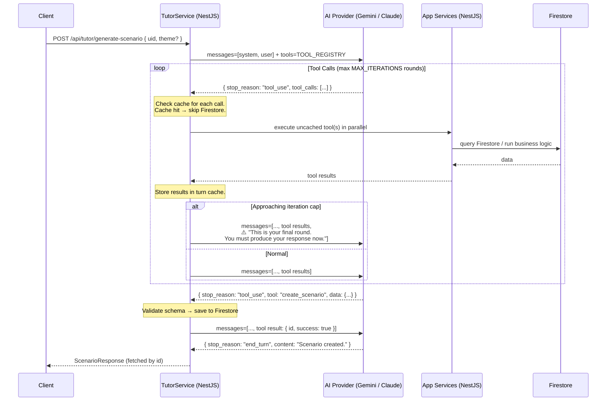

# Personal Tutor — Tool Use Design

## Motivation

Current AI interactions bake the entire `tutorContext` into a static prompt. The AI
receives everything whether it needs it or not, and has no way to ask follow-up
questions about the user's data. Tool Use (function calling) inverts this: the AI
drives its own data gathering, fetching only what it needs, in whatever order makes
sense for the specific request.

---

## Agent Loop



### Loop rules

- Runs until `stop_reason === "end_turn"` or `iteration === MAX_ITERATIONS`.
- `MAX_ITERATIONS = 5`. On iteration 4 (one before the cap), the backend injects a
  warning message into the conversation: *"This is your final opportunity to call
  tools. You must produce your complete response in the next turn."*
- Each iteration may contain multiple parallel tool calls — the backend executes them
  concurrently and returns all results in a single `tool_results` message.
- If the cap is hit with no final response, `TutorService` throws a structured error
  so the caller can surface it cleanly.

---

## Tool Registry

Tools are the AI's interface to the app. Each tool is a thin adapter over an existing
NestJS service method — the service owns the business logic, auth checks, and data
contracts. The AI just gets a well-typed description.

### Read tools

| Tool Name | Description | Parameters | Returns | Service |
|-----------|-------------|------------|---------|---------|
| `get_user_profile` | JLPT level, communication style, preferred role | — | `{ jlptLevel, communicationStyle, preferredUserRole }` | `StatsService` |
| `get_frontier_vocab` | Recently learned vocab the AI should reinforce | `facetTypes?: FacetType[]` | `TutorVocabEntry[]` | `StatsService` |
| `get_leech_vocab` | Vocab the user repeatedly fails; needs repair | `facetTypes?: FacetType[]` | `TutorVocabEntry[]` | `StatsService` |
| `get_allowed_grammar` | Grammar patterns the user has been exposed to | — | `string[]` | `StatsService` |
| `get_weak_grammar` | Grammar the user struggles with | — | `TutorVocabEntry[]` | `StatsService` |
| `get_curriculum_node` | Current position in the learning curriculum | — | `string` | `StatsService` |
| `get_knowledge_unit` | Full lesson data for a specific KU | `kuId: string` | `KnowledgeUnit + lesson` | `LessonsService` |
| `search_knowledge_units` | Find KUs by type / level / theme | `{ type?, jlptLevel?, theme? }` | `GlobalKnowledgeUnit[]` | `KnowledgeUnitsService` |
| `get_level_seed` | Curated baseline grammar and core vocab for a JLPT level | `{ jlptLevel: string }` | `{ grammar: string[], vocab: string[] }` | `TutorToolExecutor` (static data) |

### Write tools

| Tool Name | Description | Parameters | Returns | Service |
|-----------|-------------|------------|---------|---------|
| `create_scenario` | Validate and save a completed scenario | `ScenarioData` | `{ id: string, success: true }` | `ScenariosService` |

The AI calls `create_scenario` when it has finished gathering context and is ready to
produce the artifact. The backend validates the schema before saving — the AI never
writes to Firestore directly. `end_turn` after a successful `create_scenario` is a
confirmation; the client receives the saved document by `id`.

Write tools for tutor context mutation (`flag_difficulty`, `record_observation`) are
deferred to Phase 5.

---

## Bootstrap Strategy

New users have empty tutor context. The AI must degrade gracefully rather than
failing or hallucinating. There are two context signals; their weight shifts over time:

```
         Day 1              Day 7              Day 30+
         ─────              ─────              ───────
Signal   Level only         Level + sparse     Rich personal context
                            personal
         ↓                  ↓                  ↓
Tools    get_user_profile   get_user_profile   get_user_profile
         get_level_seed     get_frontier_vocab get_frontier_vocab
         search_knowledge   get_allowed_grammar get_leech_vocab
           _units(level)    get_level_seed     get_allowed_grammar
                            (fallback)         get_weak_grammar
                                               (level_seed rarely needed)
```

### Self-resolving via content roadmap

The bootstrap problem is largely self-resolving:

- **Grammar KU corpus** — A set of Grammar KUs will be added to the global pool for
  each JLPT level. Once present, `search_knowledge_units(jlptLevel, type: "Grammar")`
  gives the AI real grammar content to anchor scenarios even before the user has
  enrolled in anything.
- **Daily learning activity** — A daily activity will enroll Vocab and Grammar KUs
  into the user's queue. Enrollment triggers the existing hooks:
  `addToAllowedGrammar` (on Grammar enrollment) and `addToFrontierVocab` (on
  graduation to reviewing). After a user's first few daily sessions, `allowedGrammar`
  and `frontierVocab` have real data and `get_level_seed` is rarely needed.

`get_level_seed` is therefore a **narrow bridge** — only required for the very first
interaction before the user has completed any daily learning. It is worth keeping as
a guaranteed non-empty fallback but should not be over-engineered.

### `get_level_seed`

Returns a static, curated set of grammar patterns and core vocabulary for a given
JLPT level. Maintained as a backend constant — not Firestore. It is the AI's
guaranteed non-empty fallback.

```typescript
// Example N5 seed
{
  grammar: ["～は～です", "～が好き", "～てください", "～ている", "～たい"],
  vocab:   ["食べる", "飲む", "行く", "来る", "する", "見る", "聞く"]
}
```

### System prompt guidance for sparse context

The AI is told explicitly how to handle empty tool results:

```
If get_frontier_vocab or get_allowed_grammar return empty results, call
get_level_seed with the user's jlptLevel. Use the seed grammar and vocab
as the constraint baseline. Do not invent grammar patterns or vocabulary
outside that baseline.
```

---

## Turn Cache

Within a single agent turn, tool results are memoised by `(toolName, stableArgs)`.
The best backend call is the one you didn't need to make.

```
Cache key: `${toolName}:${JSON.stringify(sortedArgs)}`
Scope:      single TutorService.run() invocation (discarded after response)
Storage:    plain Map<string, unknown> — no Redis, no TTL needed
```

Tools with no parameters (e.g. `get_user_profile`, `get_allowed_grammar`) will
always hit the cache after their first call. Parameterised tools (e.g.
`get_knowledge_unit`) cache per argument set.

---

## AI Provider Abstraction

Gemini is the current provider. The tool use API shapes differ between Gemini and
Claude, so `TutorService` talks to an `AiProvider` interface rather than a Gemini
SDK import directly. Switching providers becomes a config change.

```typescript
interface AiProvider {
  chat(params: {
    system: string;
    messages: AiMessage[];
    tools: AiToolDefinition[];
  }): Promise<AiResponse>;
}

// AiResponse union:
type AiResponse =
  | { type: 'tool_use'; calls: AiToolCall[] }
  | { type: 'end_turn'; content: string };
```

`GeminiProvider` and (future) `ClaudeProvider` implement this interface.
`tutor.module.ts` selects the provider via an env var (`AI_PROVIDER=gemini|claude`).

---

## System Prompt (skeleton)

```
You are a personal Japanese tutor AI. Your job is to create personalised learning
content for this specific user based on their live progress data.

You have access to tools that fetch data about this user from the app backend.
Use them — do not guess at the user's level, vocabulary, or grammar knowledge.

Guidelines:
- Always call get_user_profile first to establish JLPT level and communication style.
- Call get_frontier_vocab and get_allowed_grammar to understand what the user knows.
- If either returns empty, call get_level_seed(jlptLevel) and use that as your
  constraint baseline instead. Do not invent grammar or vocab outside the baseline.
- Use frontier_vocab items where natural; do not force them.
- If the user has leech_vocab, weave repair opportunities into the content.
- Keep output at the user's jlptLevel unless the task explicitly requires otherwise.
- When you have gathered sufficient context, call create_scenario to produce the output.
- You will be warned when you are on your final tool round. Heed that warning.
```

---

## Backend File Structure

```
backend/src/tutor/
  tutor.module.ts           — imports StatsModule, LessonsModule, KnowledgeUnitsModule,
                              ScenariosModule
  tutor.controller.ts       — POST /tutor/generate-scenario, /tutor/generate-question
  tutor.service.ts          — agent loop: send → tool calls → send → ... → end_turn
  tutor-tool.registry.ts    — TOOL_REGISTRY (provider-agnostic tool definitions)
  tutor-tool.executor.ts    — dispatches AiToolCall → injected service method
  level-seed.data.ts        — static curated grammar/vocab baselines per JLPT level
  providers/
    ai-provider.interface.ts
    gemini.provider.ts
    claude.provider.ts      — stub, wired up when AI_PROVIDER=claude
```

`TutorService.run(uid, messages)` is the only entry point for consumers. It owns the
loop entirely and never exposes intermediate tool turns to the client.

---

## Phase Plan

| Phase | Scope |
|-------|-------|
| 1 | Scaffold `TutorModule`: agent loop, tool registry, turn cache, `GeminiProvider`, `get_level_seed` |
| 2 | Migrate scenario generation to `TutorService` (includes `create_scenario` write tool) |
| 3 | Migrate AI-Generated-Question generation |
| 4 | Evaluate answer evaluation and lesson generation for fit |
| 5 | Write tools for tutorContext mutation + `ClaudeProvider` |
